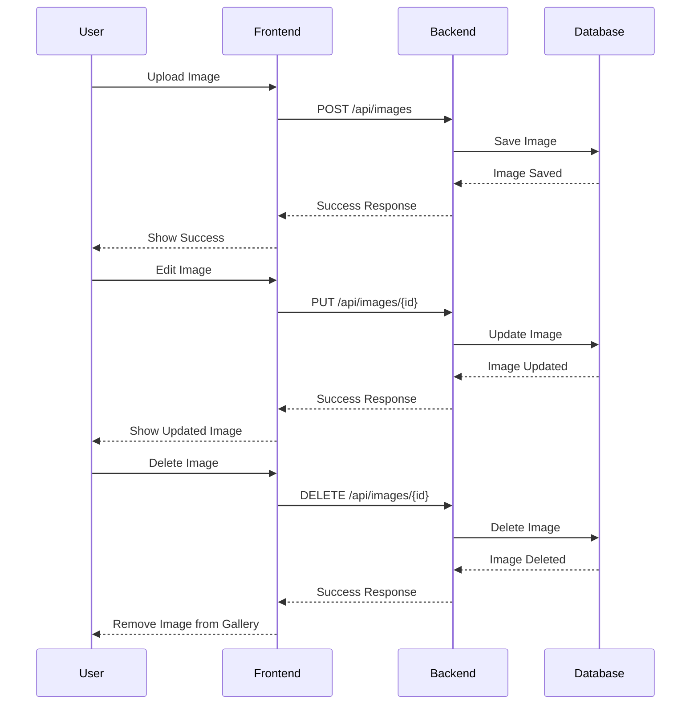

# Image Viewer Project Documentation

## Table of Contents
1. [Dependencies](#dependencies)
2. [Project Architecture](#project-architecture)
3. [Workflow](#workflow)
4. [Service Interactions](#service-interactions)
5. [File Execution Flow](#file-execution-flow)
6. [Flow Diagram](#flow-diagram)

## Dependencies

### Frontend (Angular 17)
- **@angular/core**: Core Angular framework
- **@angular/material**: UI components and theming
- **@angular/cdk**: Component Development Kit
- **ngx-image-cropper**: Image cropping functionality
- **rxjs**: Reactive programming library
- **@angular/common/http**: HTTP client for API calls
- **@angular/forms**: Form handling
- **@angular/router**: Routing functionality
- **@angular/animations**: Animation support

### Backend (ASP.NET Core 7.0)
- **Microsoft.EntityFrameworkCore**: ORM framework
- **Microsoft.EntityFrameworkCore.SqlServer**: SQL Server provider
- **Microsoft.EntityFrameworkCore.Tools**: EF Core tools
- **Microsoft.AspNetCore.Cors**: CORS support
- **Microsoft.AspNetCore.Mvc**: MVC framework
- **Microsoft.AspNetCore.StaticFiles**: Static file serving
- **Microsoft.Extensions.Configuration**: Configuration management
- **Microsoft.Extensions.DependencyInjection**: Dependency injection

## Project Architecture

### Frontend Structure
```
src/
├── app/
│   ├── components/
│   │   ├── gallery/
│   │   ├── image-editor/
│   │   └── upload/
│   ├── services/
│   │   └── image.service.ts
│   ├── models/
│   │   └── image.model.ts
│   └── environments/
│       ├── environment.ts
│       └── environment.prod.ts
└── assets/
    └── images/
```

### Backend Structure
```
API/
├── Controllers/
│   └── ImageController.cs
├── Models/
│   ├── Image.cs
│   └── ImageDto.cs
├── Data/
│   └── ApplicationDbContext.cs
├── Migrations/
└── appsettings.json
```

## Workflow

### Image Upload Flow
1. User drags and drops image in gallery component
2. `GalleryComponent` handles file selection
3. `ImageService` processes the file and sends to backend
4. Backend `ImageController` receives the file
5. File is saved to database and storage
6. Response is sent back to frontend
7. Gallery is updated with new image

### Image Editing Flow
1. User clicks edit on an image
2. `GalleryComponent` opens `ImageEditorComponent`
3. User makes edits (crop, rotate, flip)
4. On save, `ImageService` sends edited image to backend
5. Backend updates the image in database
6. Gallery is refreshed with updated image

## Service Interactions

### Frontend Services
1. **ImageService**
   - Handles all image-related API calls
   - Manages image upload, retrieval, update, and deletion
   - Provides error handling and loading states

2. **DialogService**
   - Manages modal dialogs
   - Handles image editor popup
   - Manages user interactions

### Backend Services
1. **ImageController**
   - Handles HTTP requests
   - Manages image CRUD operations
   - Implements file handling logic

2. **ApplicationDbContext**
   - Manages database connections
   - Handles entity relationships
   - Provides data access layer

## File Execution Flow

### Frontend Flow
1. `main.ts` → Bootstraps Angular application
2. `app.module.ts` → Configures application modules
3. `app.component.ts` → Root component initialization
4. `gallery.component.ts` → Main gallery view
5. `image.service.ts` → API communication
6. `image-editor.component.ts` → Image editing interface

### Backend Flow
1. `Program.cs` → Application startup
2. `appsettings.json` → Configuration loading
3. `ImageController.cs` → Request handling
4. `ApplicationDbContext.cs` → Database operations
5. `Image.cs` → Data model handling

## Flow Diagram



## Key Features Implementation

### Image Upload
1. Frontend validation
2. File size check
3. MIME type verification
4. Server-side processing
5. Database storage
6. Response handling

### Image Editing
1. Client-side cropping
2. Rotation handling
3. Flip operations
4. Preview generation
5. Save/Update options
6. Error recovery

### Database Operations
1. Connection management
2. Transaction handling
3. Error logging
4. Data validation
5. Performance optimization
6. Backup procedures
